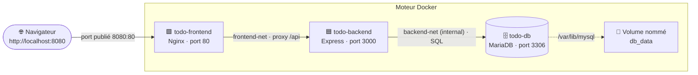

# 🐳 Todo List — Projet de soutenance Docker (ESGI)

Application full-stack **conteneurisée** de gestion de tâches, conçue pour
démontrer les notions Docker du cours : images multi-stage, réseaux
personnalisés et isolation, volumes et persistance, healthchecks, orchestration
avec Docker Compose, et publication sur Docker Hub.

> ⚠️ Le code applicatif est volontairement minimal : **toute la valeur du projet
> est dans la configuration Docker**. Les fichiers Docker sont abondamment
> commentés en français et servent de support de révision.

---

## 📦 Stack technique

| Couche        | Technologie                    | Conteneur       | Rôle |
|---------------|--------------------------------|-----------------|------|
| Front-end     | Vue.js 3 + Vite, servi par Nginx | `todo-frontend` | Interface web + **reverse proxy** vers l'API |
| Back-end      | Node.js 20 + Express + mysql2  | `todo-backend`  | API REST `/api/tasks`, `/api/health` |
| Base de données | MariaDB 11.4 (image officielle) | `todo-db`     | Stockage des tâches |

Fonctionnalités de l'app : lister, ajouter, marquer comme terminée et supprimer
des tâches.

---

## 🗺️ Architecture Docker

### Schéma (Mermaid)



- **frontend-net** (bridge) relie `todo-frontend` ⇄ `todo-backend`.
- **backend-net** (bridge, `internal: true`) relie `todo-backend` ⇄ `todo-db`.
- `todo-frontend` n'est **PAS** sur `backend-net` → il ne peut **pas** joindre la base.

### Schéma (ASCII — si Mermaid ne s'affiche pas)

```
                          HÔTE (votre machine)
                       http://localhost:8080
                                 │   (SEUL port publié : 8080 -> 80)
   ┌─────────────────────────────┼──────────────────────────────────────┐
   │  DOCKER                      ▼                                       │
   │   ┌──────────────── frontend-net (bridge) ───────────────────┐      │
   │   │                                                           │      │
   │   │   ┌──────────────┐       /api  (proxy)   ┌──────────────┐ │      │
   │   │   │ todo-frontend│ ────────────────────▶ │ todo-backend │ │      │
   │   │   │   Nginx :80  │                        │ Express :3000│ │      │
   │   │   └──────────────┘                        └──────┬───────┘ │      │
   │   └──────────────────────────────────────────────────┼────────┘      │
   │                                                       │               │
   │   ┌─────────── backend-net (bridge, INTERNAL) ────────┼────────┐      │
   │   │                                                   ▼        │      │
   │   │                                            ┌──────────────┐│      │
   │   │                                            │   todo-db    ││      │
   │   │                                            │ MariaDB :3306││      │
   │   │                                            └──────┬───────┘│      │
   │   └───────────────────────────────────────────────────┼───────┘      │
   │                                                        │ /var/lib/mysql│
   │                                                 ┌──────▼───────┐       │
   │                                                 │ volume db_data│       │
   │                                                 └──────────────┘       │
   └────────────────────────────────────────────────────────────────────────┘

   ⛔ todo-frontend n'est pas sur backend-net : il ne peut PAS atteindre todo-db.
```

### Flux d'une requête (ex. « lister les tâches »)

```
Navigateur                Nginx (frontend)         Express (backend)        MariaDB (db)
   │  GET /api/tasks          │                          │                      │
   ├─────────────────────────▶│  (port 8080 -> 80)       │                      │
   │                          │  proxy_pass              │                      │
   │                          ├─────────────────────────▶│  via frontend-net    │
   │                          │   http://backend:3000    │                      │
   │                          │                          │  SELECT * FROM tasks │
   │                          │                          ├─────────────────────▶│ via backend-net
   │                          │                          │◀─────────────────────┤
   │                          │◀─────────────────────────┤   lignes             │
   │◀─────────────────────────┤   JSON                   │                      │
   │   [ {...}, {...} ]        │                          │                      │
```

---

## ✅ Prérequis

- [Docker](https://www.docker.com/) **et** Docker Compose v2
  (`docker --version`, `docker compose version`).
- Le port **8080** libre sur votre machine.

---

## 🚀 Installation pas à pas

```bash
# 1. Récupérer le projet
git clone <url-de-votre-repo> docker-soutenance
cd docker-soutenance

# 2. Créer le fichier .env à partir de l'exemple, puis l'éditer
cp .env.example .env            # Windows PowerShell : Copy-Item .env.example .env
#   -> renseignez DOCKERHUB_USER et les mots de passe MySQL

# 3. Construire les images et démarrer toute la stack en arrière-plan
docker compose up --build -d

# 4. Suivre l'initialisation (facultatif)
docker compose ps
docker compose logs -f
```

Puis ouvrez **http://localhost:8080** 🎉

Pour tout arrêter :

```bash
docker compose down            # arrête et supprime les conteneurs (garde le volume)
docker compose down --volumes  # ... et supprime AUSSI les données (volume db_data)
```

---

## 🔍 Description détaillée des éléments du `docker-compose.yml`

### Services

| Service    | Image                              | Ports          | Réseaux                      | Dépend de |
|------------|------------------------------------|----------------|------------------------------|-----------|
| `frontend` | `${DOCKERHUB_USER}/todo-frontend:v1.0` (build local) | **8080:80** (publié) | `frontend-net`               | `backend` (healthy) |
| `backend`  | `${DOCKERHUB_USER}/todo-backend:v1.0` (build local)  | *aucun* (privé)      | `frontend-net`, `backend-net`| `db` (healthy) |
| `db`       | `mariadb:11.4` (officielle)        | *aucun* (privé)| `backend-net`                | —         |

- **`frontend`** : image multi-stage (Node compile Vue → Nginx sert le résultat).
  Nginx fait aussi le **reverse proxy** de `/api` vers `backend:3000`. C'est le
  **seul service exposé** sur l'hôte (port 8080).
- **`backend`** : API Express. **Aucun port publié** → joignable uniquement par
  le frontend via `frontend-net`. Se connecte à la base via `backend-net`.
  Possède un **healthcheck** (`/api/health`).
- **`db`** : MariaDB officielle. **Aucun port publié**. Lit ses identifiants
  depuis `.env` (`env_file`). Possède un **healthcheck** officiel
  (`healthcheck.sh`).

### Réseaux

| Réseau         | Driver | Particularité    | Membres                | But |
|----------------|--------|------------------|------------------------|-----|
| `frontend-net` | bridge | —                | frontend, backend      | Le front joint le back |
| `backend-net`  | bridge | **`internal: true`** | backend, db        | Le back joint la base, **isolée du monde** |

> `internal: true` coupe ce réseau de l'extérieur (pas de route NAT vers
> Internet ni vers l'hôte). Combiné au fait que le frontend n'est pas membre de
> `backend-net`, **la base est totalement inatteignable depuis l'extérieur et
> depuis le front** : c'est l'argument « communication sécurisée » du sujet.

### Volume

| Volume    | Monté sur          | Type        | But |
|-----------|--------------------|-------------|-----|
| `db_data` | `/var/lib/mysql`   | volume nommé| **Persistance** des données MariaDB |

> Le script `./db/init.sql` est monté en **bind mount** dans
> `/docker-entrypoint-initdb.d/` : il crée la table `tasks` et insère des
> données de démo, **uniquement au premier démarrage** (volume vide).

---

## 🧪 Guide de test (exigé par le sujet)

### A. Tester la communication inter-conteneurs et l'isolation réseau

**1) Le backend PEUT joindre la base (réseau `backend-net`)**

Preuve applicative la plus simple — le healthcheck interroge réellement la base :

```bash
curl http://localhost:8080/api/health
# -> {"status":"ok","db":"connected"}   (le backend a fait un SELECT sur la db)
```

Preuve réseau directe (résolution DNS + connexion TCP vers la db) :

```bash
docker exec todo-backend getent hosts db        # "db" se résout en une IP
docker exec todo-backend nc -z -v db 3306        # port 3306 de la db ouvert : OK
```

**2) Le frontend ne PEUT PAS joindre la base (isolation prouvée)**

```bash
docker exec todo-frontend ping -c 2 db
# -> ping: bad address 'db'   (le nom "db" n'est même pas résolu :
#    frontend et db ne partagent aucun réseau)
```

**3) Visualiser qui est sur quel réseau**

```bash
docker network inspect docker-soutenance_backend-net   # backend + db
docker network inspect docker-soutenance_frontend-net  # frontend + backend
```

> Le frontend n'apparaît jamais dans `backend-net` : CQFD.

### B. Tester la persistance des données (volume)

```bash
# 1. Ajoutez quelques tâches via l'interface http://localhost:8080
#    (ou en API : curl -X POST http://localhost:8080/api/tasks \
#       -H "Content-Type: application/json" -d '{"title":"Test persistance"}')

# 2. Arrêtez la stack SANS supprimer le volume
docker compose down

# 3. Redémarrez
docker compose up -d

# 4. Rechargez http://localhost:8080  ->  vos tâches sont TOUJOURS LÀ ✅
#    (le volume db_data a survécu ; init.sql n'a PAS été rejoué)
```

Pour montrer l'effet inverse (suppression des données) :

```bash
docker compose down --volumes   # supprime le volume db_data
docker compose up -d            # base recréée vide -> init.sql rejoué (données de démo)
```

### C. Commandes utiles

```bash
docker compose ps                 # état et santé des 3 conteneurs
docker compose logs backend       # logs d'un service (retry DB, "Backend à l'écoute")
docker compose logs -f            # logs en continu de toute la stack

docker network ls                 # liste des réseaux (dont frontend-net, backend-net)
docker network inspect docker-soutenance_backend-net

docker volume ls                  # liste des volumes (dont docker-soutenance_db_data)
docker volume inspect docker-soutenance_db_data

docker exec -it todo-db mariadb -u root -p   # ouvrir un shell SQL dans la base
docker stats                      # consommation CPU/RAM des conteneurs
```

---

## 📁 Structure du projet

```
docker-soutenance/
├── docker-compose.yml      # orchestration (3 services, 2 réseaux, 1 volume)
├── .env.example            # modèle de variables (VERSIONNÉ)
├── .env                    # secrets réels (IGNORÉ par git)
├── .gitignore
├── README.md               # ce fichier
├── REVISION-ORAL.md        # fiche de révision + Q/R du jury
├── docker-hub.md           # commandes de publication des images
├── front/
│   ├── Dockerfile          # multi-stage : Node (build) -> Nginx (prod)
│   ├── nginx.conf          # service du SPA + reverse proxy /api
│   ├── .dockerignore
│   └── src/ ...            # application Vue 3 (code minimal)
├── back/
│   ├── Dockerfile          # Node 20, cache de layers, user non-root
│   ├── .dockerignore
│   ├── server.js           # API Express + pool MariaDB + retry
│   └── package.json
└── db/
    └── init.sql            # table tasks + données de démo (1er démarrage)
```

---

## 📚 Pour aller plus loin

- **`REVISION-ORAL.md`** : synthèse complète du cours Docker + explication ligne
  par ligne des fichiers + questions probables du jury + scénario de démo.
- **`docker-hub.md`** : publication des images `todo-frontend` et `todo-backend`.
